# Lab-3-immersion-day
Passo a passo do Laboratório do evento Immersion day focado na criação e configuração do AWS S3

# Amazon S3 Hands-On Lab

## Visão geral do Amazon S3
O Amazon Simple Storage Service (Amazon S3) é um serviço de armazenamento de objetos que oferece escalabilidade, disponibilidade de dados, segurança e desempenho líderes do setor. Ele pode ser usado para armazenar e recuperar qualquer quantidade de dados, a qualquer hora, de qualquer lugar na web.

Este laboratório foi desenvolvido para lhe dar alguma experiência na interação com o serviço S3 por meio do Console da AWS e demonstrar o caso de uso de acesso seguro a objetos dentro de um bucket S3 privado por meio de um host da Web EC2.

## Este laboratório orientará você sobre o seguinte:
- Criando um bucket no S3
- Adicionando objetos ao seu bucket S3
- Trabalhando com objetos no console S3
- Acessando objetos armazenados no S3
- Habilitando o controle de versão do bucket
- Configurando uma Política de Ciclo de Vida
- Limpeza: Excluindo os objetos e o bucket S3

## Legenda do texto do laboratório
- "Texto citado" - Faz referência a um título, cabeçalho ou nome no console.
- **Texto em negrito** - Representa um botão, link ou menu suspenso no qual você precisará clicar ou selecionar.
- Inline code- Texto que você precisa copiar para entrada (textos mais longos terão um botão de cópia, textos mais curtos serão apenas destacados).
- Inline code [with brackets]- O texto entre parênteses representa o texto que requer uma entrada única. A entrada necessária será indicada entre parênteses.

## Duração do laboratório
Este laboratório levará cerca de 1 hora para ser concluído.

## 💰 Custos de Laboratório

| Categoria               | Custo por hora | Custo mensal |
|-------------------------|----------------|---------------|
| Amazon S3 (fotos)       | $0,00          | $0,00         |
| Amazon EC2 - t2.micro   | $0,0116        | $8,47         |

**Custo total do workshop:** US$ 0,50 – US$ 1,00
> 💲 [Calculadora de preços AWS](https://calculator.aws/#/)

## Pré-requisitos:
Se quiser visualizar as imagens carregadas no seu bucket S3 e ver o versionamento em ação posteriormente no laboratório, você precisará de um host web. Este recurso de host web permitirá que você interaja com o seu bucket S3 em um ambiente real. Clique no link do modelo abaixo para criar o host web no EC2 usando o CloudFormation. .

## Baixe e inicie o modelo CloudFormation

1. Baixe o modelo CloudFormation aqui [Baixar S3-General-ID-Lab.yaml](https://github.com/brunocco/Lab-3-immersion-day/raw/main/Yaml%20para%20baixar/S3-General-ID-Lab.Yaml) e salve-o no seu disco rígido local.

2. Agora abra o CloudFormation serviço.
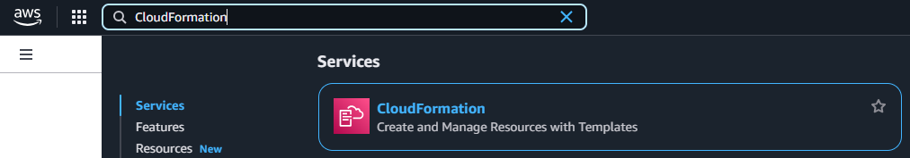

3. No console do CloudFormation, selecione o botão **Criar pilha** e, em seguida, selecione **Com novos recursos (padrão)**.
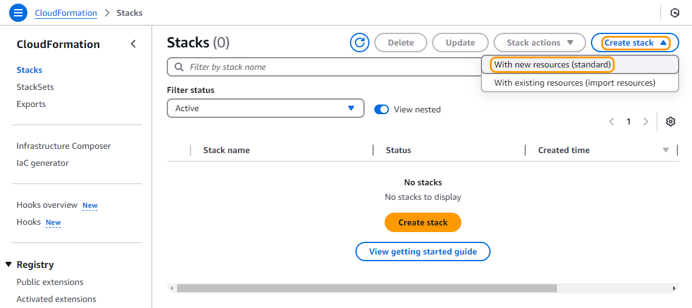

4. Em "Especificar modelo", selecione **"Carregar um arquivo de modelo"** e, em seguida, selecione o botão **"Escolher arquivo"**. Selecione o arquivo de modelo "S3-General-ID-Lab.yaml" que você baixou na primeira etapa. Após selecionar o arquivo de modelo, clique no botão **"Avançar"**.
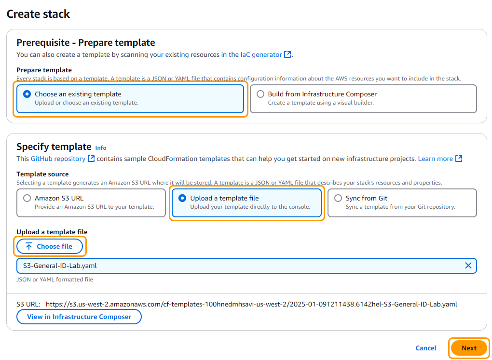

5. Na página Especificar detalhes da pilha, preencha os seguintes campos:

a. Em "Nome da pilha", nomeie sua pilha .[Your Initials]-S3-Web-Host

b. Você pode deixar "AmiID" como padrão, resultando no uso da versão mais recente desta AMI.

c. Em "InstanceType", selecione **t2.micro** ( nível gratuito) ou você pode escolher m5.large se tiver algum problema com o t2.micro por qualquer motivo.

d. Em "MeuIP", insira o endereço IP da sua máquina local seguido de . Isso bloqueará a porta HTTP 80 para a sua máquina. Você pode encontrar seu IP local usando este site:  [AWS Check IP/32](https://checkip.amazonaws.com/)

>**Problemas de IP local**
>
>Se houver problemas para obter seu endereço IP local devido às configurações de segurança da sua máquina ou se ele mudar sempre que você atualizar o site "AWS Check >IP", será necessário usar 0.0.0.0/0. Lembre-se de que não é uma prática recomendada deixar a porta 80 aberta para o mundo em uma instância que não esteja por trás de >algo como um balanceador de carga.

e. Em "MyVPC", selecione a VPC que deseja usar para configurar a instância. Na maioria das contas, a VPC padrão será uma boa escolha, mas em novas contas da AWS, será a única opção.

f. Em "PublicSubnet", selecione uma sub-rede dentro da sua VPC que tenha acesso à internet. Uma sub-rede pública é definida por uma sub-rede que possui uma rota para o gateway de internet dentro de sua tabela de rotas. Por padrão, todas as sub-redes da VPC padrão são públicas.

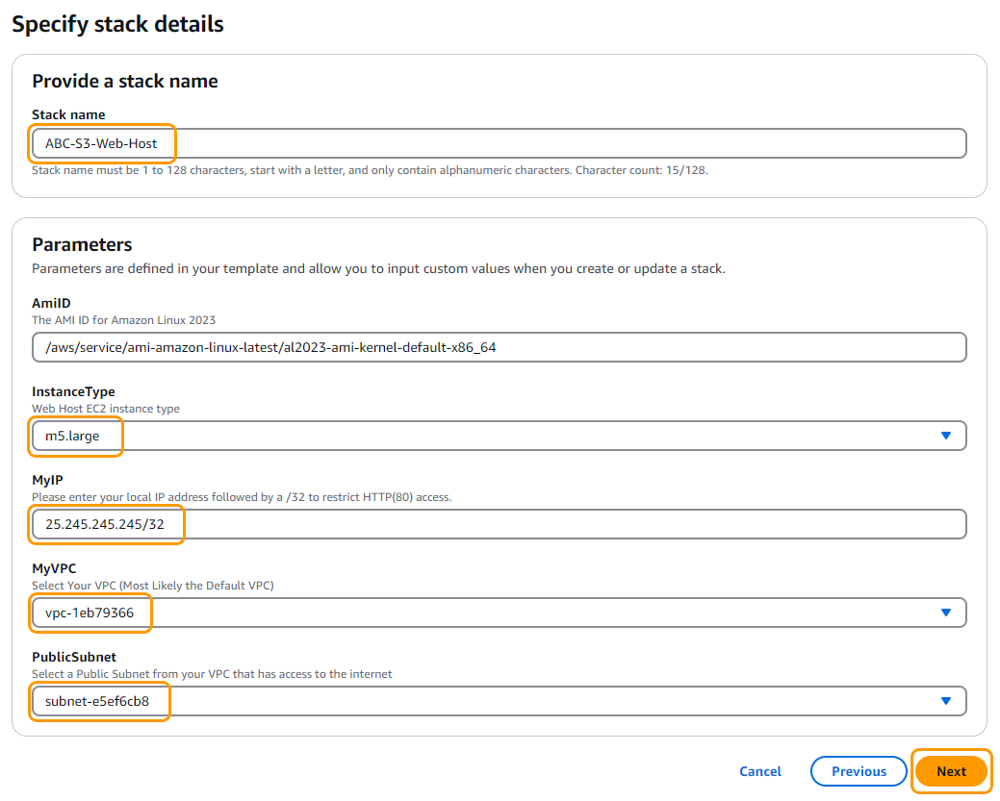

6. Após inserir os detalhes acima, clique em Avançar . Na próxima página, "Configurar opções de pilha", você pode deixar "Tags", "Permissões" e "Opções avançadas" como padrão e selecionar Avançar .

7. Na página Revisar [Suas Iniciais]-S3-Web-Host, revise suas configurações e clique em Enviar para começar a construir seu servidor web.

8. Aguarde até que o "ID Lógico" "[Suas Iniciais]-S3-Web-Host" mostre o status "CREATE_COMPLETE". Você precisará clicar no botão de atualização para obter o status atualizado da sua pilha.
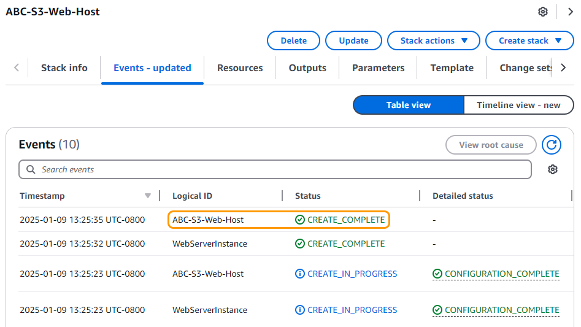
>A criação da pilha do CloudFormation deve ser concluída em cerca de 3 minutos.

O script CloudFormation agora criou a arquitetura abaixo:
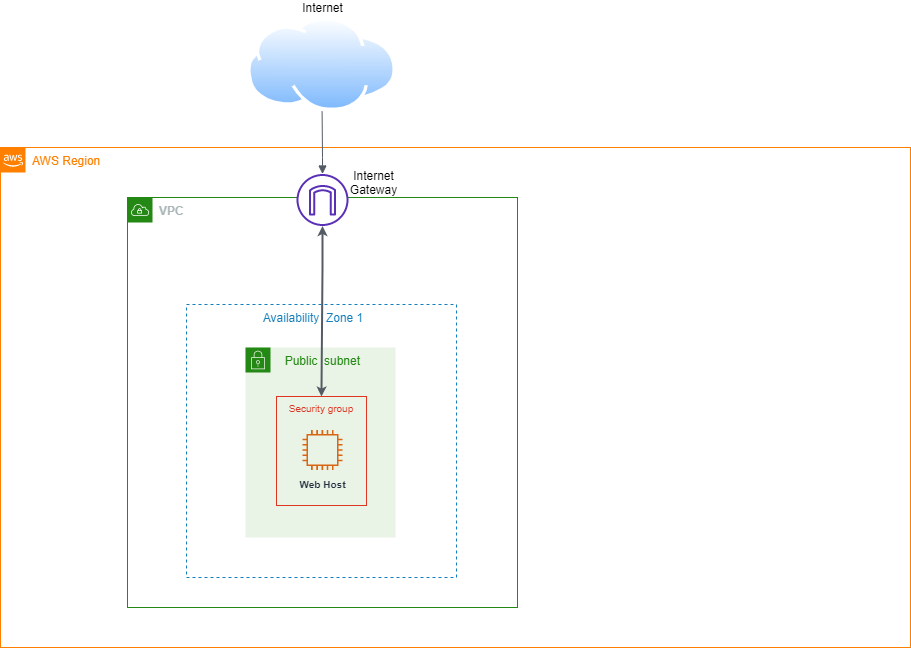

## Confirme a configuração bem-sucedida da sua instância
1. Navegue até o console do serviço EC2 .

2. Selecione Instâncias no menu à esquerda. Na página "Instâncias", selecione sua instância "[Suas Iniciais]-S3-Web-Host" e copie o endereço "DNS IPv4 Público" para a sua área de transferência clicando na imagem de dois quadrados sobrepostos à esquerda do Endereço DNS IPv4 Público. Cole este endereço em uma nova aba do seu navegador.

>Abrindo a página da web
>1. Você também precisará esperar que a "Verificação de status" mostre 3/3 verificações aprovadas antes de abrir a página da web.
>2. Selecionar o link "abrir endereço" sob o título "DNS IPv4 público" pode impedir que você visualize seu site. O link "abrir endereço" usa https:// em vez de http://, o que resultará em um erro, pois nosso host não foi configurado com um certificado SSL.
>3. Ao colar seu endereço DNS, alguns navegadores podem adicionar automaticamente https:// antes do endereço. Pode ser necessário inserir manualmente https:// antes do endereço DNS se estiver recebendo um erro de acesso.http://
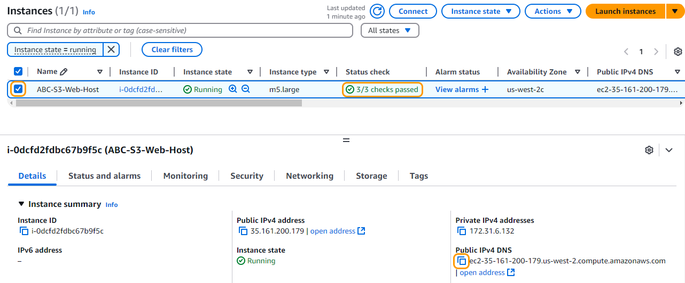

3. Agora você deve ver a página "Laboratório prático do S3", que usaremos mais tarde no laboratório.
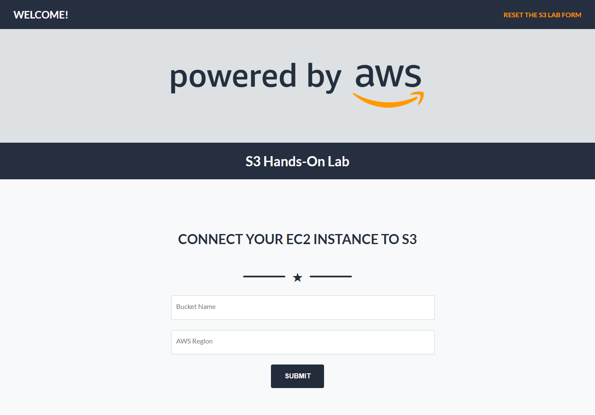

>Se a página não carregar, é recomendável que você espere até que a "Verificação de status" da sua instância mostre 3/3 verificações aprovadas e tente novamente.

Agora você está pronto para iniciar o laboratório

## Criando um bucket no S3

Cada objeto no Amazon S3 é armazenado em um bucket. Antes de armazenar dados no Amazon S3, você precisa criar um bucket.
> Você não é cobrado pela criação de um bucket; você só é cobrado pelo armazenamento de objetos no bucket e pela transferência de objetos para dentro e para fora do bucket.

1. Navegue até o console do serviço S3 .

2. Clique no botão **Criar bucket** e você será levado para a página "Criar bucket".
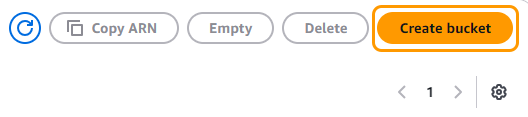

3. Em "Região da AWS", confirme se esta é a região que você está usando para o laboratório.

4. Certifique-se de que **Uso geral** esteja selecionado para "Tipo de bucket".

5. Digite um nome no campo **Nome do Bucket**.

O nome do bucket escolhido deve ser único entre **todos os nomes de bucket existentes** no Amazon S3. Uma maneira de tornar o nome do seu bucket único é prefixar o nome do bucket com suas iniciais e o nome da sua organização. Por exemplo:**[your initials]-[your org]-s3-lab**

Os nomes dos buckets devem atender aos seguintes requisitos:

- Pode conter apenas letras **minúsculas**, números, pontos (.) e traços (-)
- Deve começar com um número ou letra
- Deve ter entre 3 e 255 caracteres
- Não deve ser formatado como um endereço IP (por exemplo, 265.255.5.4)
- Não pode conter espaços

6. A próxima seção é "Bloquear configurações de acesso público para este bucket". Trabalharemos com um bucket privado, portanto, deixe **a opção Bloquear todo o acesso público** marcada. Você pode configurar seu bucket para acesso público, concedendo aos usuários e aplicativos direitos totais de leitura aos objetos dentro do bucket por meio de um endereço DNS exclusivo. Neste laboratório, não abriremos nossos buckets S3 ao público. É considerada uma prática recomendada da AWS não abrir seus buckets para acesso público, a menos que seja absolutamente necessário. Em uma seção posterior, abordaremos o processo de configuração de acesso aos seus objetos sem tornar o bucket público.

7. Você pode deixar o restante das configurações como padrão por enquanto. Habilitaremos o versionamento em nosso bucket mais tarde no laboratório. Agora clique no botão Criar bucket 

8. Agora você estará de volta à página que mostra todos os seus buckets S3. Clique no nome do bucket que você acabou de criar.
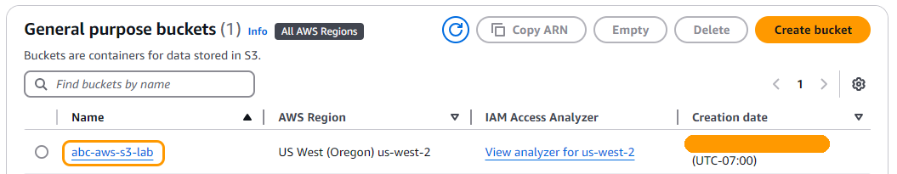

9. Agora você está na página de visão geral do seu bucket, ela deve mostrar seu bucket com Objetos (0).
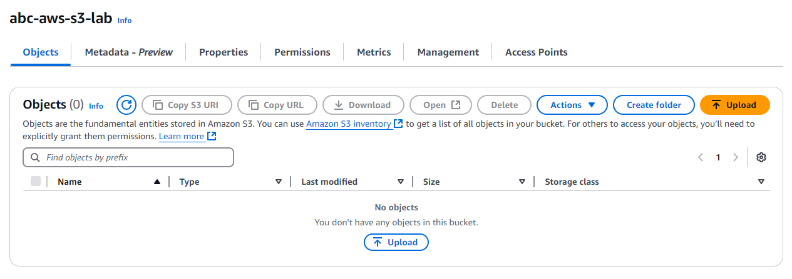

## Adicionando objetos ao seu bucket S3
Agora que você criou um bucket, está pronto para adicionar objetos a ele.
Um objeto pode ser qualquer tipo de arquivo: um arquivo de texto, uma foto, um vídeo, etc. Ao adicionar um arquivo ao Amazon S3, você tem a opção de incluir metadados com o arquivo e definir permissões para controlar o acesso ao arquivo.

1. Você vai carregar 7 fotos no seu bucket. Baixe este arquivo zip e extraia as fotos para o seu disco rígido local: [baixe aqui photos.zipl](https://github.com/brunocco/Lab-3-immersion-day/raw/main/photos/photos.zip) 

2. No seu arquivo zip, confirme que você tem sete arquivos chamados "photo1.jpg" a "photo7.jpg" e um diretório chamado "V2" contendo um arquivo chamado "photo1.jpg".

3. Na página de visão geral do seu novo bucket, clique em **Upload** na aba "Objetos".
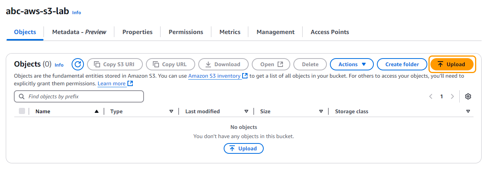

4. Em seguida, clique no botão **Adicionar Arquivos** para selecionar os arquivos a serem enviados. Envie os arquivos "photo1.jpg" a "photo7.jpg" da raiz da pasta "photos", ignorando "photo1.jpg" na pasta "V2", pois o usaremos em uma seção posterior deste laboratório.
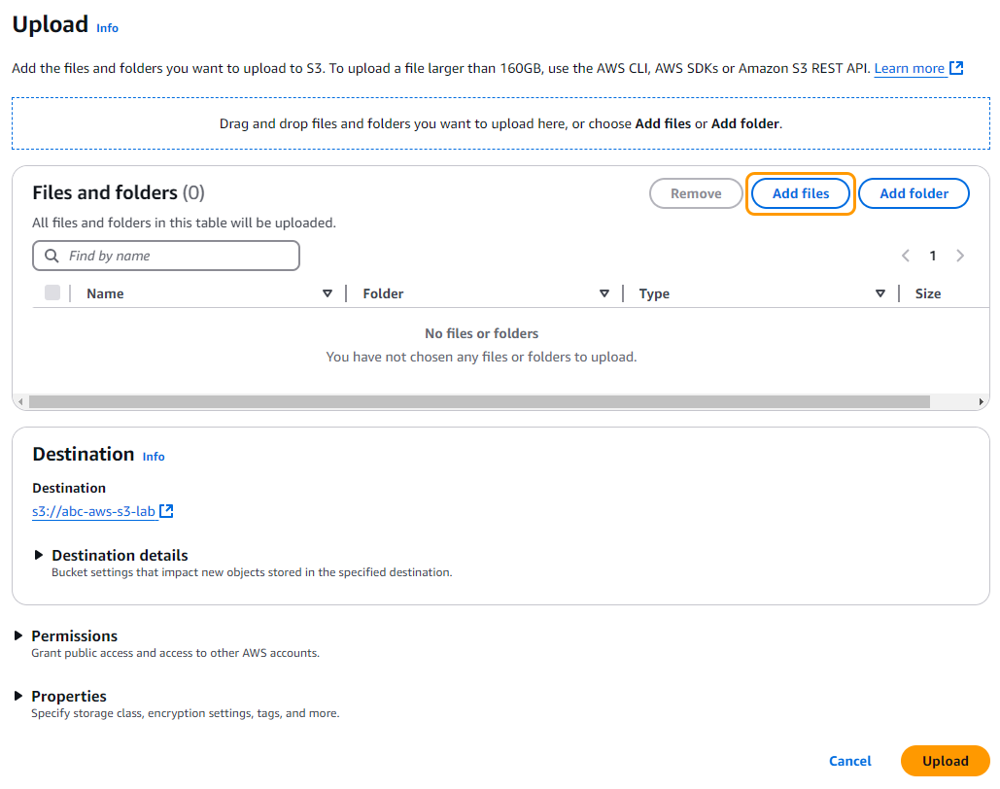

5. Depois de selecionar os arquivos de imagem, a caixa de diálogo "Upload" deverá mostrar os arquivos que você selecionou para upload.

Na parte inferior da página, você pode clicar nas setas ao lado de "Permissões e propriedades" para explorar as opções adicionais para carregar esses arquivos.
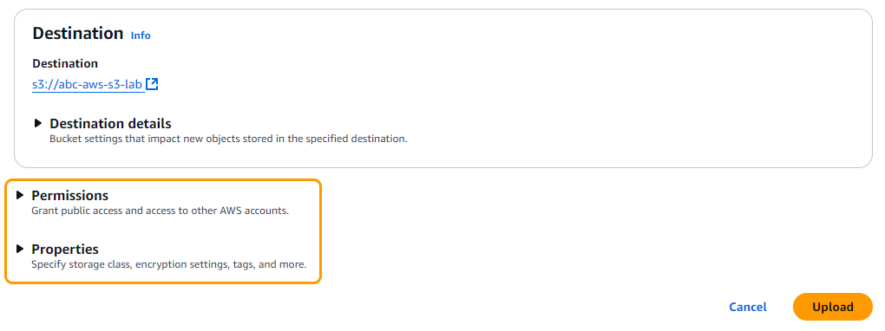

6. Com essas opções de upload, você pode definir sua classe de armazenamento, criptografia, tags, metadados, etc. Dependendo do seu caso de uso, você pode escolher outras classes de armazenamento, mas para este laboratório, usaremos a classe de armazenamento Padrão. Todas as outras configurações podem ser deixadas com os valores padrão.
Clique no botão **Upload** na parte inferior da página.
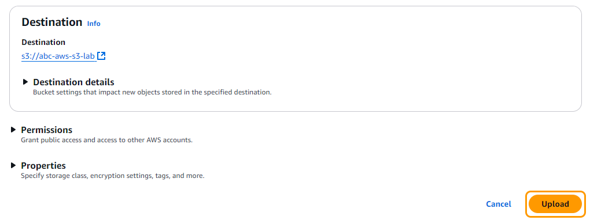

Você deverá ver suas imagens sendo carregadas no topo da página:
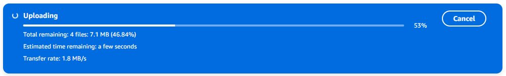

Quando o upload estiver concluído, você deverá ver "Upload bem-sucedido":
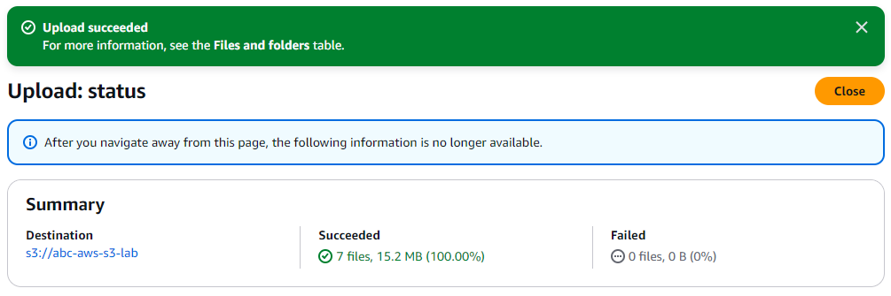

7. Agora clique em **Fechar** para retornar à página de visão geral do bucket. Você deverá ver todas as sete fotos no seu bucket que agora são objetos do S3.
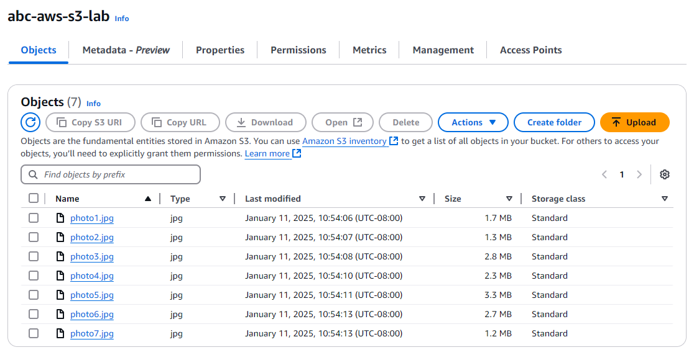

Aqui está a arquitetura que você construiu até agora:

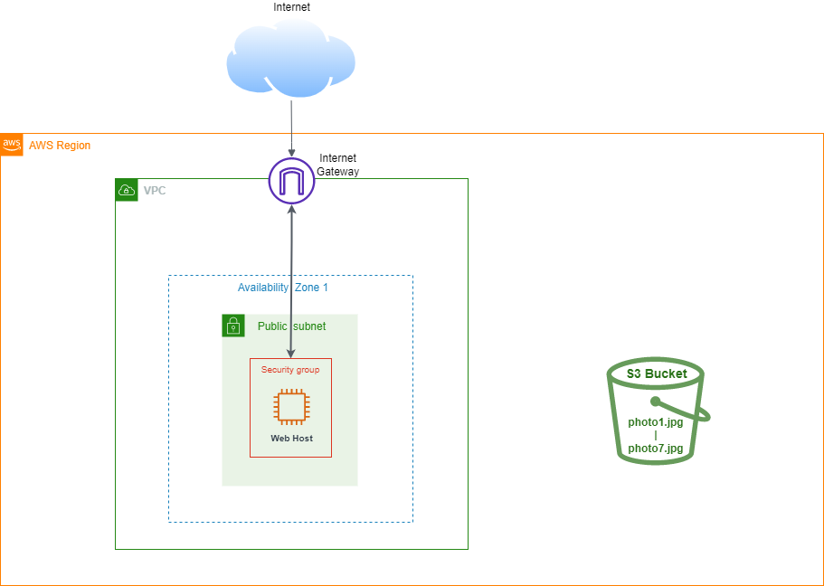

## Trabalhando com objetos no console S3

No console do S3, você pode trabalhar com objetos em uma interface gráfica.
O console do S3 oferece muitos comandos familiares do sistema de arquivos. Você pode renomear, mover, copiar, excluir e visualizar, para citar alguns.

Você também pode criar uma pasta (também conhecida como "prefixo"), adicionar ou remover metadados, editar a classe de armazenamento e copiar o URI ou URL do S3 do objeto. Abordaremos algumas dessas ações nesta seção do laboratório.
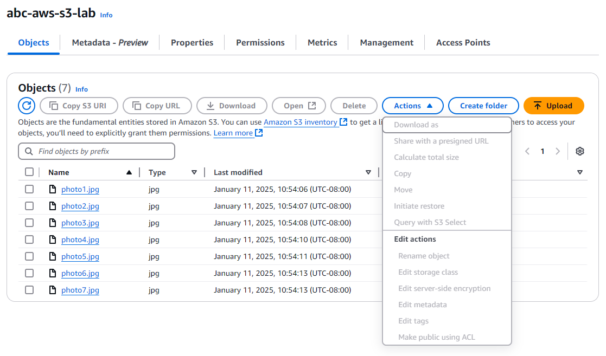

## Movendo um objeto no S3
Com a ação de movimentação no console do S3, você pode mover um objeto para uma pasta (prefixo) no mesmo bucket, para outro bucket/prefixo ou para um ponto de acesso. Neste exemplo, criaremos uma nova pasta (prefixo) e moveremos o objeto photo7.jpg.

1. Na página de visão geral do seu bucket, selecione o botão **Criar pasta**.

2. No campo "Nome da pasta", insira o nome e clique no botão **Criar pasta**.photo7
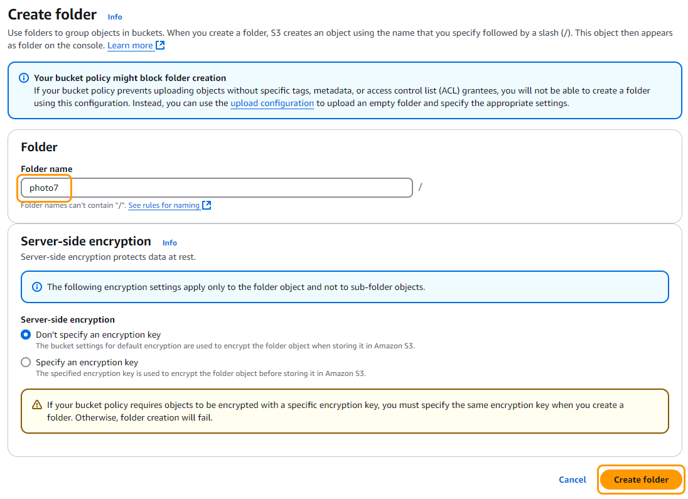

3. Agora selecione o objeto "photo7.jpg", clique no menu suspenso **Ações** e selecione **Mover**.
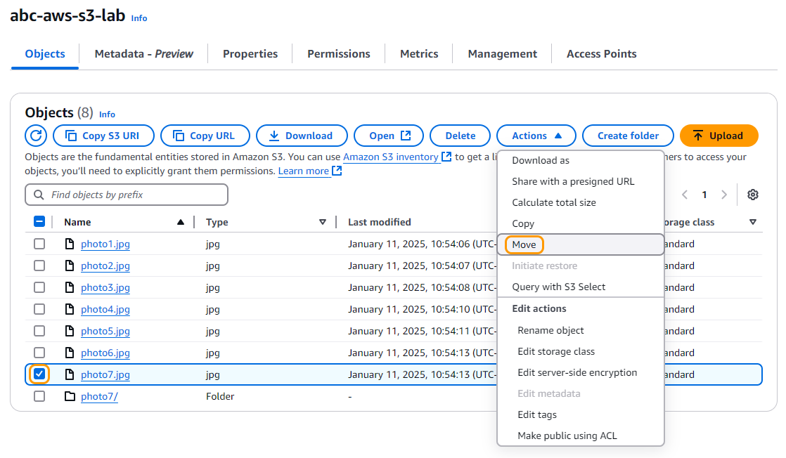

4. Em "Tipo de destino", selecione **Bucket de uso geral** e clique em **Procurar S3**.
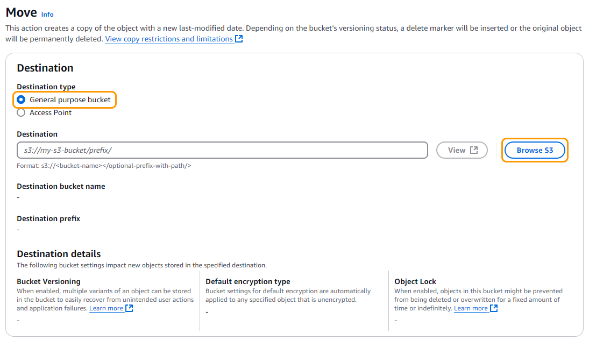

5. No pop-up "Destino", selecione a pasta **photo7/** (prefixo) e clique em **Escolher destino** .
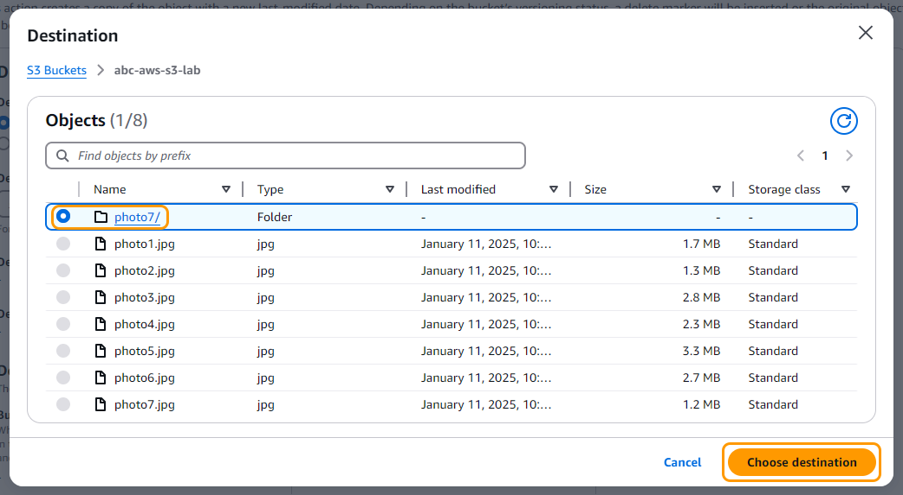

6. Agora que o destino foi definido, você pode clicar no botão **Mover** para mover o objeto.
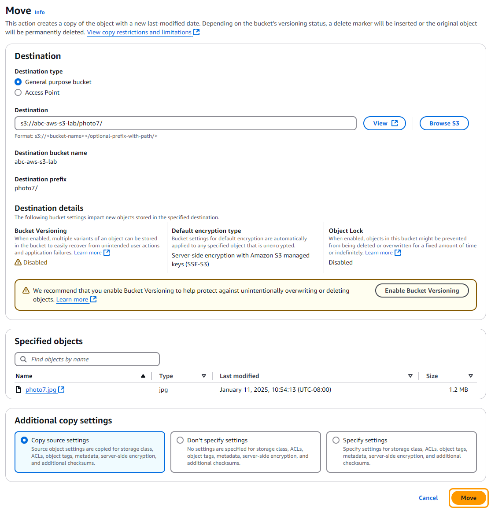

7. Você será levado para a página "Mover: status", que mostra que os objetos foram movidos com sucesso. Clique no botão **Fechar** para sair da página.
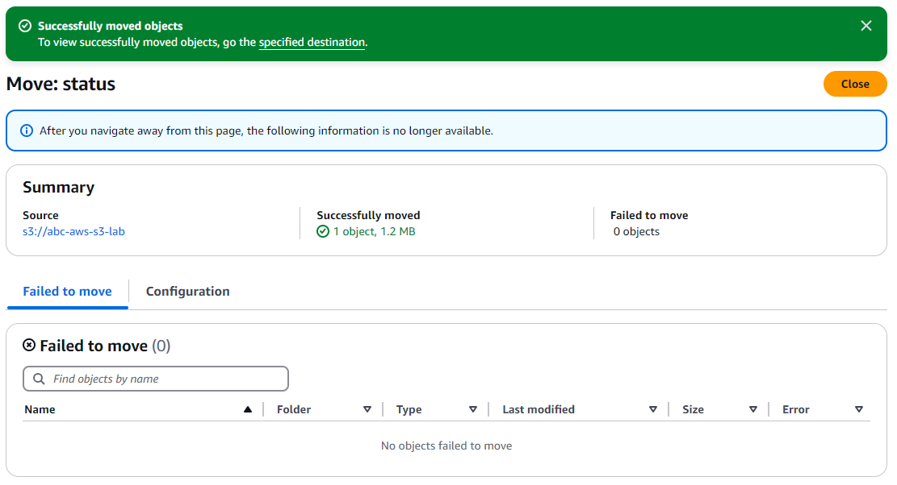

8. Agora você pode clicar na pasta "photo7/" e ver que "photo7.jpg" foi movido.
>Mover um objeto cria uma cópia do objeto com configurações atualizadas e uma nova data da última modificação no local especificado e, em seguida, adiciona um marcador de exclusão ao objeto original.

9. As etapas são semelhantes às de copiar um objeto, comece selecionando o objeto ou objetos e depois selecione **Ações** e **Copiar** .
O comando "Mover" é um dos muitos comandos familiares do sistema de arquivos. Você também pode "Baixar" arquivos diretamente para o seu computador, "Renomear objetos" e "Abrir" diversos tipos de objetos diretamente no seu navegador.

Ações de objetos específicos do S3
Você encontrará diversas ações que pode realizar em um objeto específico do S3:

- **Copiar URI do S3:** O URI do S3 atua como um endereço interno para acesso a buckets e objetos por alguns serviços da AWS.
- **Copiar URL**: Mesmo que sejam privados, a menos que você os torne públicos, todos os buckets e objetos têm uma URL. Por exemplo, "photo1.jpg" no bucket "abc-aws-s3-lab" localizado na região "us-west-2" teria a URL "abc-aws-s3-lab.s3.us-west-2.amazonaws.com/photo1.jpg".
- **Editar classe de armazenamento:** Isso altera a classe de armazenamento para o objeto, isso é melhor feito por uma política de ciclo de vida adequada ao caso de uso.
- **Editar metadados**: os metadados do objeto são um conjunto de pares nome-valor associados ao objeto. Esta ação cria uma nova versão do objeto com configurações atualizadas e uma nova data da última modificação.
- **Editar tags**: você pode marcar buckets ou objetos para rastrear custos de armazenamento ou outros critérios.
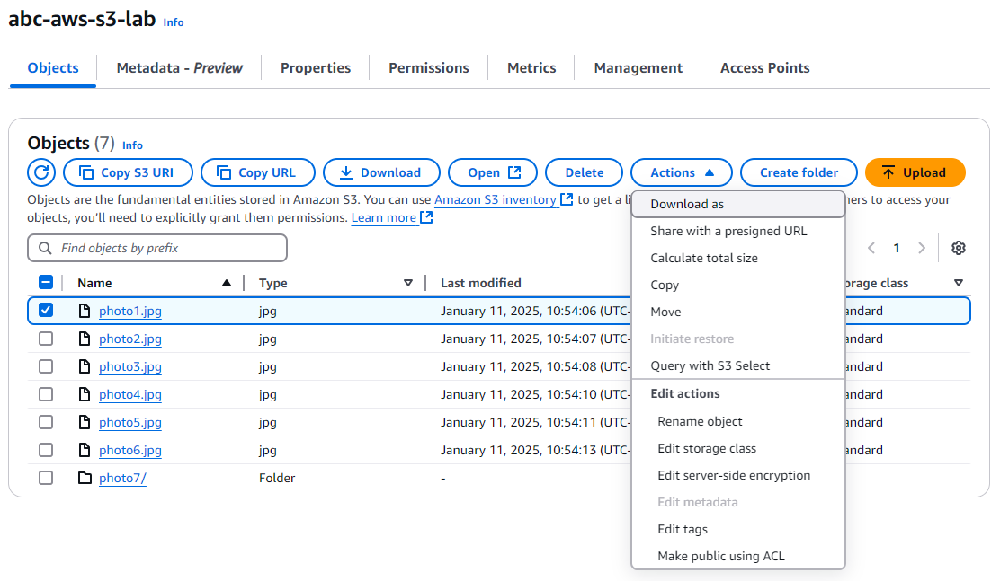

## Acessando objetos armazenados no S3
Criando uma função do IAM para sua instância do EC2
Nossa instância EC2 que criamos no início do laboratório é um servidor web que já foi configurado para visualizar nossos objetos. Precisaremos fornecer três coisas:

- Permissão de acesso ao nosso novo bucket S3: Como nosso bucket S3 é privado, faremos isso criando uma política e anexando-a a uma função no serviço de Gerenciamento de Identidade e Acesso (IAM). 
- O nome do nosso balde.
- A região que hospeda nosso balde.
- 
1. Navegue até o console do serviço IAM .
2. Primeiro, você criará uma política para sua função. Uma política de permissões define quais ações a função pode realizar e quais recursos ela pode usar. Para começar, selecione **Políticas** no menu à esquerda.
3. Selecione o botão **Criar política** .
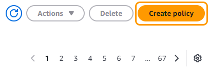

4. Na página "Especificar permissões", certifique-se de que o botão **Visual** "Editor de políticas" esteja selecionado e, em "Selecionar um serviço", selecione o **S3** no menu suspenso "Escolher um serviço".
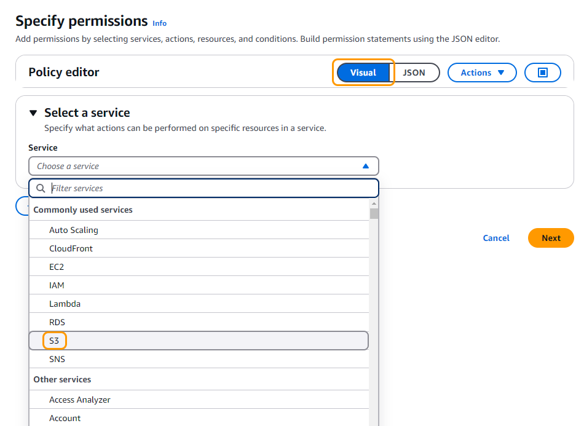

5. Em "Ações permitidas", insira a pesquisa "Ações de filtro". Marque a caixa ao lado de "GetObject" apenas. GetObject restringirá nossa instância EC2 a ler apenas objetos dentro do seu bucket de imagens.GetObject
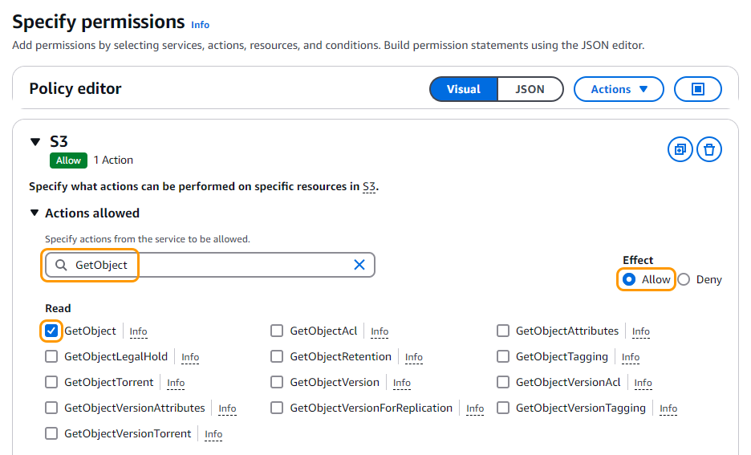

6. Adicionaremos o ARN do bucket S3 para restringir as permissões da política apenas a esse bucket. Em "Recursos", certifique-se de que **a opção Específica** esteja selecionada e clique no link **Adicionar ARNs** . (ARN significa "Nome do Recurso da Amazon")
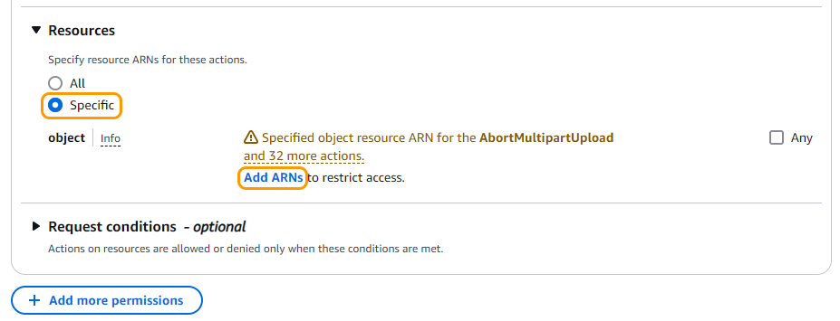

7. Na caixa de diálogo que se abre, digite ou cole no campo "Nome do bucket de recursos".[your-bucket-name]

8. No campo "Nome do objeto de recurso", marque a caixa de seleção ao lado de "Qualquer nome de objeto" e, em seguida, selecione o botão **Adicionar ARNs**.
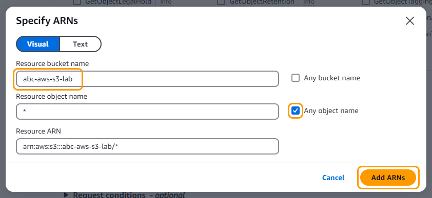

9. Sua política agora deve ser semelhante à mostrada abaixo, exceto pelo nome do bucket no lugar de "abc-aws-s3-lab". Agora clique em **Avançar** .
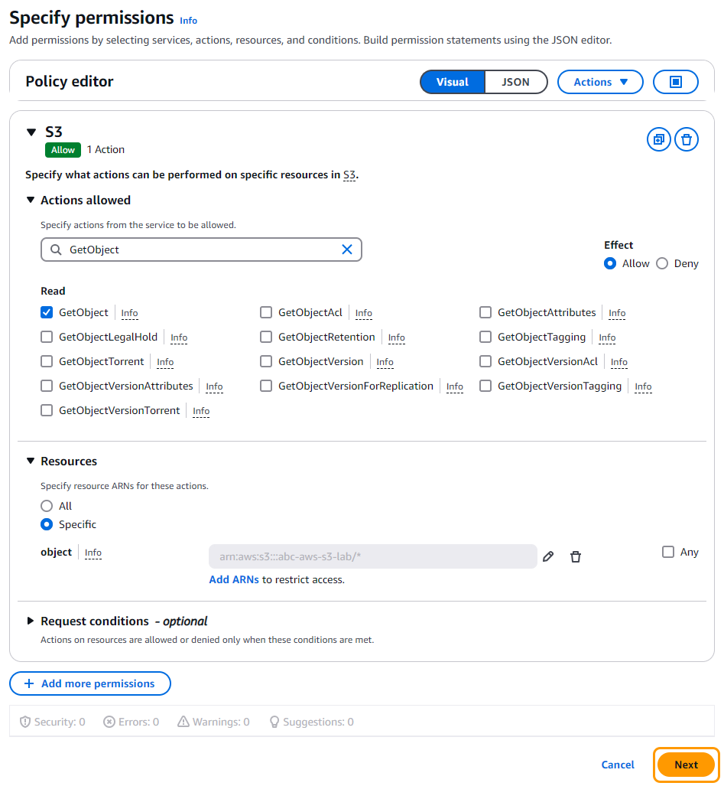

10. Em "Revisar e criar", nomeie sua política e selecione Criar política .[your initials]-EC2-S3-Access
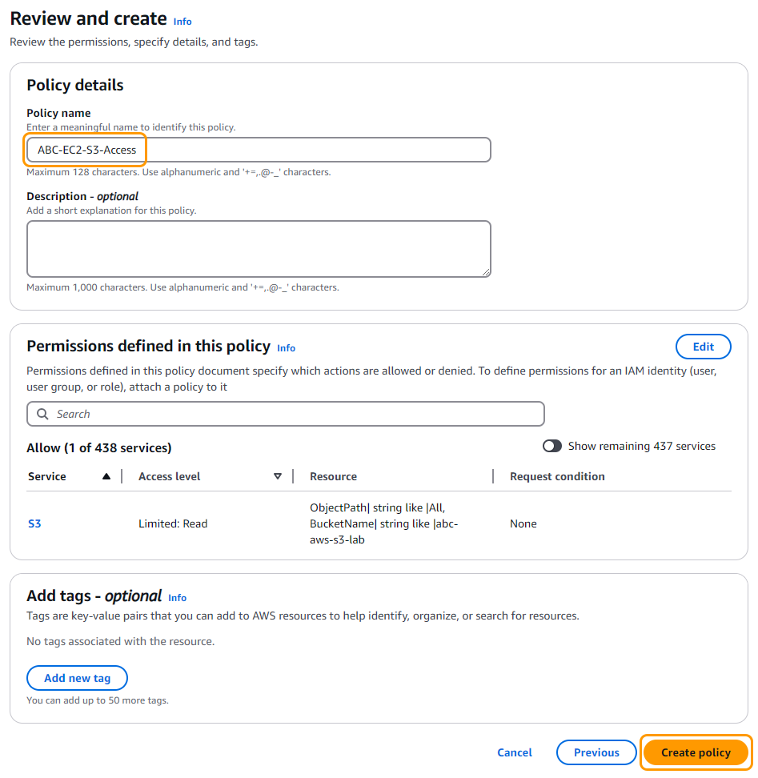

11. Em seguida, no menu à esquerda, selecione **Funções** .

12. Clique no botão **Criar função** .

13. Em "Tipo de entidade confiável", certifique-se de que o serviço AWS esteja selecionado e, em "Caso de uso", selecione EC2 .

14. Em "Escolha um caso de uso para o serviço especificado", selecione **EC2** no menu suspenso e depois selecione o botão **Avançar** .
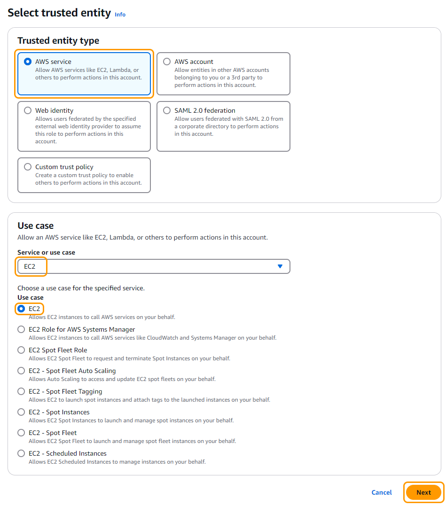

15. No campo "Políticas de filtro", procure por . Selecione a política que você criou nas etapas anteriores, **[suas iniciais]-EC2-S3-Access** , e selecione **Avançar** .S3
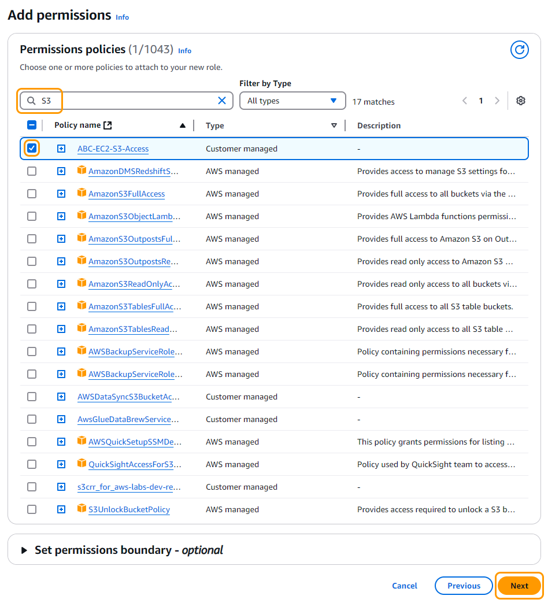

16. Nomeie sua função e selecione o botão **Criar função** .[your initials]-EC2-S3-Access-Role
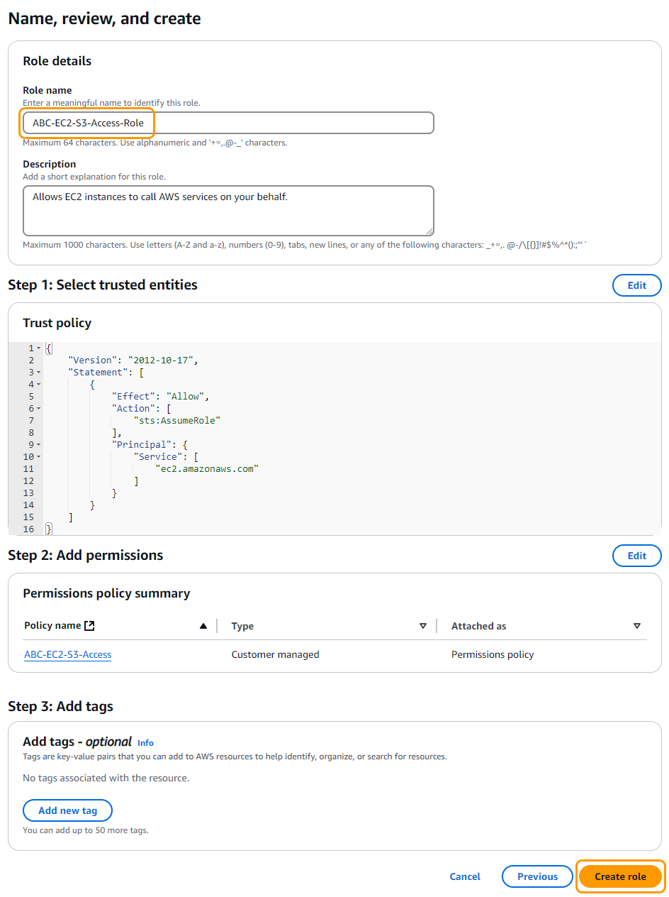

## Anexe sua nova função à sua instância EC2
Você criou com sucesso uma função que dará ao seu host web EC2 acesso para ler objetos no seu bucket S3. Você precisará anexá-la à sua instância EC2.

1. Navegue até o console do serviço EC2 .

2. Clique em **Instâncias** no menu à esquerda.

3. Encontre sua instância chamada **[suas iniciais]-S3-Web-Host**.

4. Clique com o botão direito do mouse na sua instância, selecione **Segurança** e, em seguida, **Modificar Função do IAM** . Isso também pode ser feito selecionando sua instância e clicando no botão **Ações**.
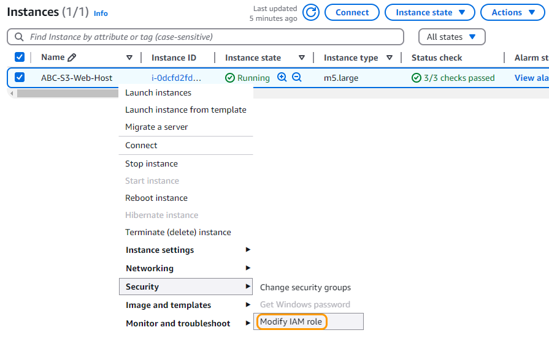

5. No menu suspenso "Função do IAM", selecione a função que você nomeou **[suas iniciais]-EC2-S3-Access-Role** e clique em **Atualizar função do IAM** .

6. Sua instância agora tem acesso de leitura ao seu bucket S3 privado.
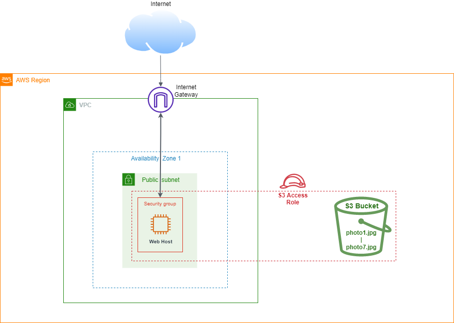

## Visualize seus objetos em um navegador da Web
Acesse a página "Instâncias" do EC2, selecione sua instância "[Suas Iniciais]-S3-Web-Host" e copie o endereço "DNS IPv4 Público" para a sua área de transferência clicando na imagem de dois quadrados sobrepostos à esquerda do Endereço DNS IPv4 Público. Cole este endereço em uma nova aba do seu navegador.

>Abrindo a página da web
>
>1. Selecionar o link "abrir endereço" sob o título "DNS IPv4 público" pode impedir que você visualize seu site. O link "abrir endereço" usa https:// em vez de >http://, o que resultará em um erro, pois nosso host não foi configurado com um certificado SSL.
>2. Ao colar seu endereço DNS, alguns navegadores podem adicionar automaticamente https:// antes do endereço. Pode ser necessário inserir manualmente https:// antes >do endereço DNS se estiver recebendo um erro de acesso.http://
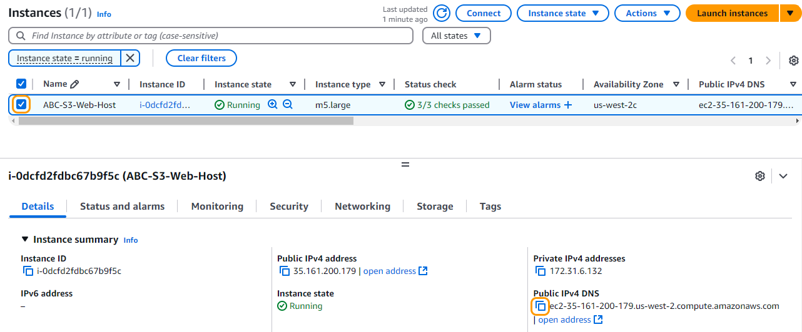

1. Agora você deve ver a página "S3 Hands-On Lab", onde pode inserir as informações do seu bucket.

2. Se precisar consultar o nome e a região do seu bucket, consulte a página de serviço do S3. A região deve ser inserida no formulário neste formato: por exemplo, us-west-2.
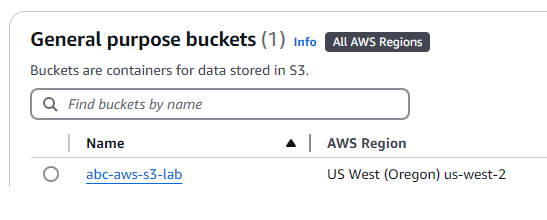

3. Insira o "Nome do Bucket" e a "Região da AWS" e clique em Enviar.
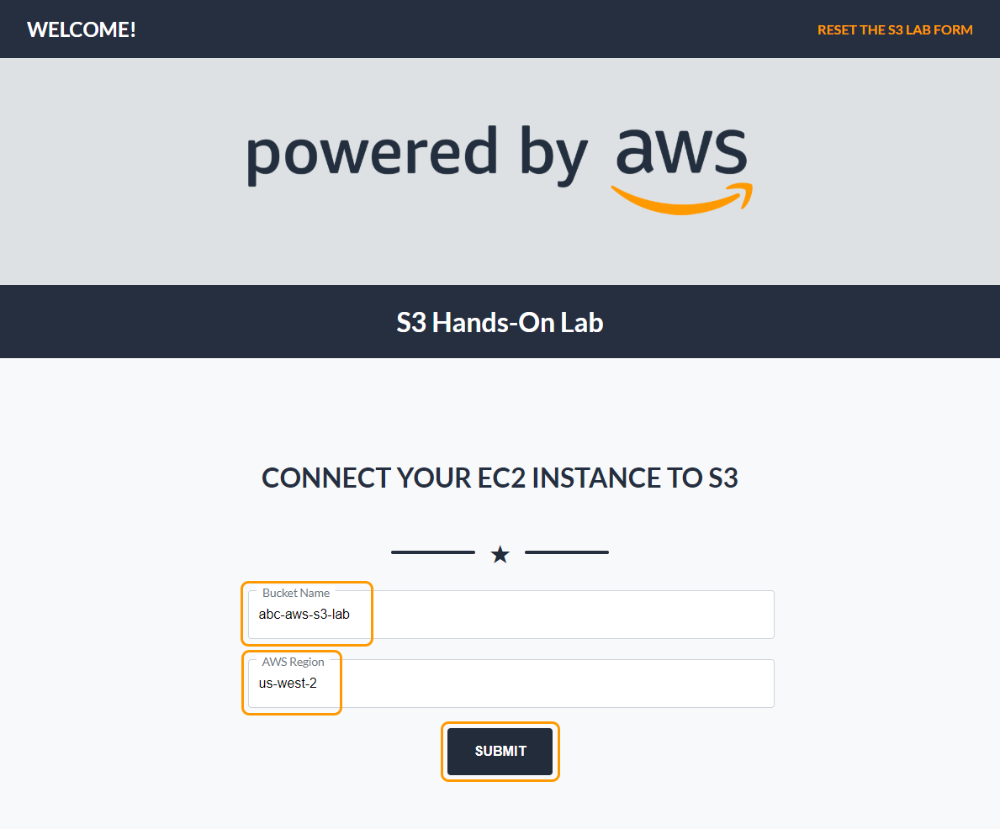

4. Após clicar em "Enviar", você verá as imagens que enviou anteriormente em uma pequena galeria. (A imagem com o X vermelho é intencional; atualizaremos esta imagem na seção de controle de versão do laboratório
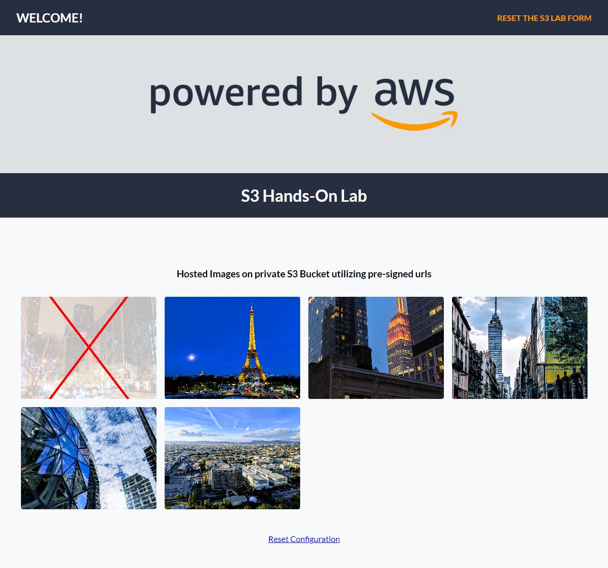

Se você estiver interessado no que acontece nos bastidores: As imagens são lidas pelo seu navegador a partir do seu bucket privado do S3. Isso é feito criando uma URL pré-assinada para cada objeto (neste caso, os objetos são as imagens). O proprietário de um objeto pode compartilhá-los com outras pessoas criando uma URL pré-assinada, usando suas próprias credenciais de segurança, para conceder permissão por tempo limitado a esses objetos. Neste caso, as credenciais de segurança que passamos para o S3 são a função que criamos para nossa instância do EC2. Se você abrir uma das imagens diretamente no seu navegador, verá a URL pré-assinada, que é bem longa.

Aqui está a arquitetura final do que construímos:
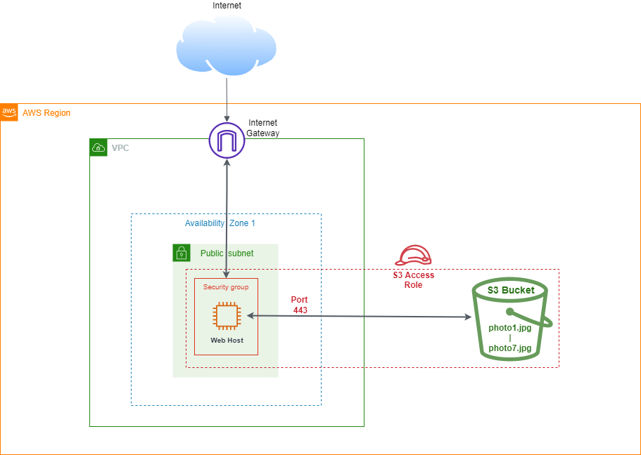
